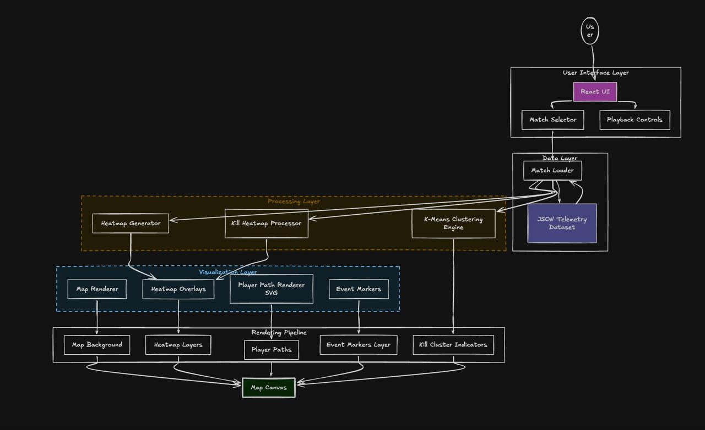

# Telemetry Viewer

A browser-based telemetry visualization tool that replays match data on a minimap.

The viewer renders player movement, game events, and analytics such as heatmaps and kill hotspots to help understand gameplay patterns.

---

## Features

### Match Playback
- Select match from dataset
- Play / Pause match replay
- Frame timeline slider

### Player Visualization
- Player movement paths
- Bot vs Human differentiation
- Smooth frame-based replay

### Event Visualization
Events rendered on the map:
- Kill events
- Loot / pickup events
- Zone events
- Position events

### Analytics
- Player movement heatmap
- Kill heatmap
- Kill hotspot clustering (K-Means)

---

## Tech Stack

Frontend:
- React
- SVG rendering
- HTML Canvas overlays

Data Processing:
- Grid-based heatmap generation
- K-Means clustering

Visualization:
- SVG polylines for player paths
- Absolute positioned event markers
- Heatmap cell overlays

---

## Architecture Diagram

---

## Project Structure
telemetry-viewer
│
├── public
│ ├── maps
│ └── data
│
├── src
│ ├── components
│ ├── utils
│ └── App.jsx
│
├── README.md
└── TECHNICAL_ARCHITECTURE.md

---

## Data Format

Each match contains:

{
match_id: string,
map_id: string,

players: [
{
user_id: string,
is_bot: boolean,
path: [[x,y], ...]
}
],

events: [
{
type: string,
pixel_x: number,
pixel_y: number
}
]
}

Map coordinates use a **1024 x 1024 coordinate system**.

---

## Running the Project

Install dependencies:

npm install

Run dev server:

npm run dev

Open:

http://localhost:5173

---

## Key Design Decisions

- Fixed map coordinate system for consistent scaling
- SVG used for efficient rendering of long player paths
- Grid-based heatmap for fast analytics
- K-Means clustering for kill hotspot detection

---

## Future Improvements

Possible enhancements:

- Zoom + pan map interaction
- Player follow camera
- Animated zone shrinking
- Real heatmap gradient rendering
- Player stats sidebar

---
